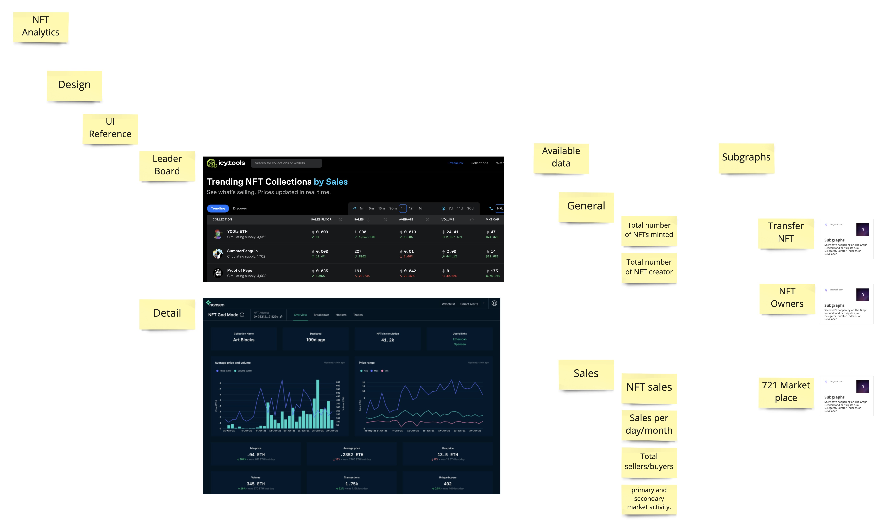
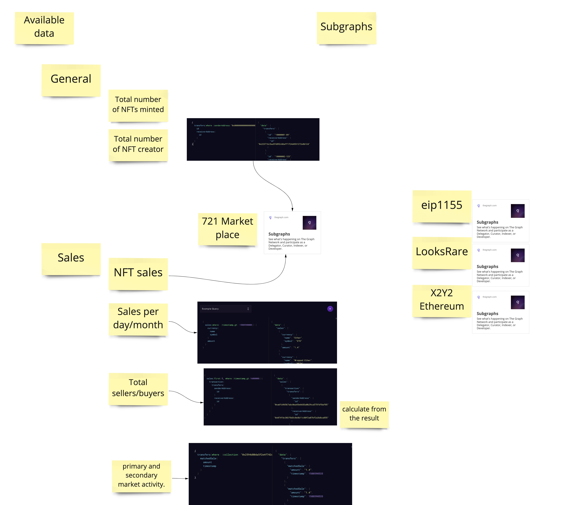
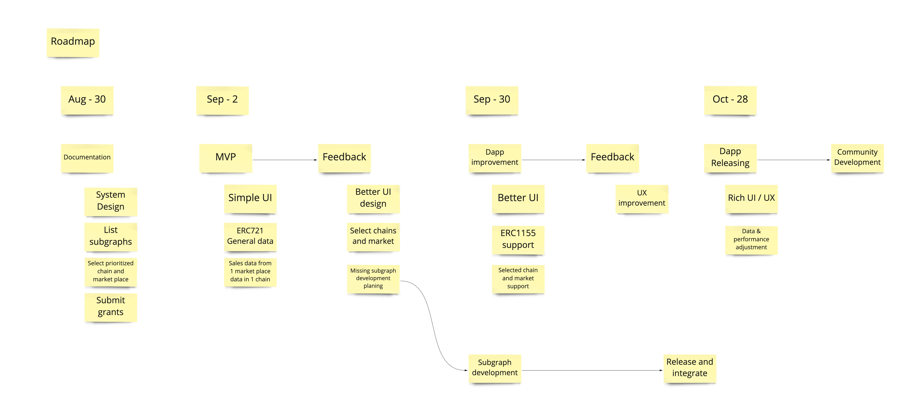

# NFT Analytics Dapp with The Graph

This is NFT Analytics Dapp with The Graph



## Whoami

[BlockBase](https://mobile.twitter.com/blockbase_inc) is blockchain development company. We supported several client to build web3 product. We have experience with building game, marketplace, creator platform using The Graph.

## Why we build this project?

We are managing NFT Minting tool [Chocomint](https://factory.chocomint.app/), and NFT crosschain bridge [NFTHashi](https://nfthashi.com/).

Both services are requiring tracking and analytics function now. Minting service requires to track how minted NFT works, and crosschain service requires to track NFT transfer history in multi-chain.

We can use existing NFT API too, but we'd like to have more decentralized solution to track/analyze NFTs.

That's why we started this project.

## How this service is valuable to The Graph ecosystem?

I believe NFT is one of the biggest use-case of blockchain, and key of the mass-adoption. So having NFT analytics tool using The Graph means bringing a lot of user in The Graph ecosystem.

And this is going to be complete NFT analytics UI only utilizing the graph data. This can show capability of the subgraph data too.

## Concept

This is NFT Analytics Dapp using The Graph, this is going to have NFT project leader board and NFT information analytics UI.

This shows general NFT information as followings.

- total number of NFTs minted
- each token's creator/holder
- token transfer history
- contract ownership

This also shows NFT sales data as followings.

- floor price
- sale amount for total, per month, per week and per day
- sales activities

Suggestion for adding more data is welcomed!

## Subgraph List

Subgraph listing and data availability check is done at this [issue](https://github.com/block-base/nft-analytics/issues/2).



## Roadmap

This is the initial roadmap of this project.



We are planning to have three big milestone in our roadmap.

- 1st milestone: Done with building MVP (by Sep 2nd)

  - Deliverable

    - Simple UI
    - ERC721 general data
    - Sales data from 1 market place

  - Feedback from commnuty and The Graph team
    - Better UI Design
    - Target chain and marketplace
    - Missing subgraph

- 2nd milestone: Dapp improvement (by Sep 30th)

  - Deliverable

    - Better UI according to last feedback
    - ERC1155 support
    - Selected chain and market support
    - Service url is open for user to try

  - Subgraph development

    - If we found some subgraph should be developed additionally, we will develop at this time.

  - Feedback
    - UX improvement for beta releasing

- 3rd milestone: (by Oct 28th)
  - Deliverable
    - Rich UI/UX
    - Data performance adjustment
  - Then we are going to move community oriented development

## Development

### Frontend

```
cd packages/frontend
yarn dev
```
